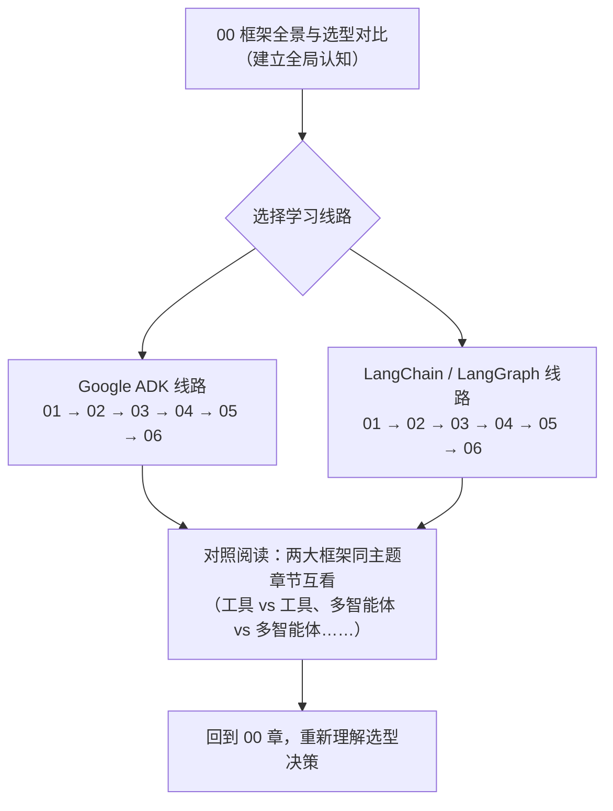

# Agent 框架深度教学：Google ADK vs LangChain / LangGraph

本仓库是一套**可执行的 Jupyter 教学笔记**，以教学视角系统讲解两大主流 Agent 开发框架：

- **Google ADK（Agent Development Kit）** —— Google 开源的智能体开发套件
- **LangChain / LangGraph** —— 生态最庞大的 LLM 应用框架与底层图编排引擎

所有代码示例均使用 **DeepSeek**（`deepseek-chat`）作为底层大模型，开箱即可运行。

---

## 📂 目录结构

```
agent-frameworks/
├── README.md                              ← 本文件
├── 00-框架全景与选型对比.ipynb              ← 建议从这里开始！
│
├── google-adk/                            【Google ADK 系列】
│   ├── 01-初识ADK-快速上手.ipynb
│   ├── 02-Agent详解与模型接入.ipynb
│   ├── 03-工具系统.ipynb
│   ├── 04-多智能体与工作流.ipynb
│   ├── 05-会话-状态与记忆.ipynb
│   └── 06-回调-观测与部署.ipynb
│
└── langchain-langgraph/                   【LangChain / LangGraph 系列】
    ├── 01-LangChain生态与模型接入.ipynb
    ├── 02-LCEL与链式编排.ipynb
    ├── 03-Agent与工具调用.ipynb
    ├── 04-LangGraph核心-图与状态.ipynb
    ├── 05-持久化-流式与人机协同.ipynb
    └── 06-多智能体模式与生态对比.ipynb
```

## ⚙️ 环境配置

本项目使用 **[uv](https://docs.astral.sh/uv/)** 管理环境与依赖（`pyproject.toml` + `uv.lock`），在 **Python 3.12** 下验证通过。

### 1. 安装依赖

```bash
# 安装 uv（如已安装可跳过）：https://docs.astral.sh/uv/getting-started/installation/
# 一键创建 .venv 并按 uv.lock 安装全部依赖
uv sync
```

> 本仓库验证时的版本：`google-adk 2.6.3`、`langchain 1.2.15`、`langgraph 1.1.10`、`langchain-openai 1.6.0`、`litellm 1.96.2`。
> ⚠️ 注意：`langchain 1.2.x` 需要 `langgraph >= 1.0`（0.x 会出现 `No module named 'langgraph._internal'` 报错）；同时 `langchain 1.2.15` 要求 `langgraph < 1.2.0`，因此锁定在 1.1.x。

### 2. 配置 DeepSeek API Key

代码通过环境变量读取密钥（**不要把密钥写进代码或 notebook**）。推荐复制 `.env.example` 为 `.env` 并填入密钥：

```bash
cp .env.example .env   # 然后编辑 .env 填入 sk-xxxxxxxx
```

启动时通过 `--env-file` 注入（见下文运行命令）。也可以手动设置环境变量：

```powershell
# Windows PowerShell（当前会话）
$env:DEEPSEEK_API_KEY = "sk-xxxxxxxx"

# Windows（永久写入用户环境变量）
setx DEEPSEEK_API_KEY "sk-xxxxxxxx"
```

```bash
# Linux / macOS
export DEEPSEEK_API_KEY="sk-xxxxxxxx"
```

两个框架接入 DeepSeek 的方式对比（各章节会详细展开）：

| 框架 | 接入方式 | 关键代码 |
|---|---|---|
| **Google ADK** | 通过内置 **LiteLLM** 适配层（LiteLLM 原生支持 DeepSeek，自动读取 `DEEPSEEK_API_KEY`） | `LiteLlm(model="deepseek/deepseek-chat")` |
| **LangChain** | DeepSeek 提供 **OpenAI 兼容接口**，用 `ChatOpenAI` 改 `base_url` 即可 | `ChatOpenAI(model="deepseek-chat", base_url="https://api.deepseek.com")` |

### 3. 运行

```bash
# 注入 .env 中的密钥并启动 JupyterLab（uv 自动使用项目 .venv）
uv run --env-file .env jupyter lab

# 若已用其他方式设置好 DEEPSEEK_API_KEY，直接：
uv run jupyter lab
```

> 💡 **Mermaid 图表**：笔记中的架构图使用 Mermaid 语法，在 **VS Code**、**GitHub** 及较新版 **JupyterLab** 的 Markdown 预览中可直接渲染；纯 JupyterLab 经典界面可能显示为源码，属正常现象。

## 🧭 推荐学习路径



- **零基础**：先读 `00`，再任选一条线路顺序学习；
- **已有 LangChain 经验**：直接进 ADK 线路，每章末尾都有「与 LangChain 对照」小节；
- **已有 ADK 经验**：直接进 LangChain 线路，重点关注 `04`（LangGraph 图模型）——这是两个框架设计哲学差异最大的地方。
