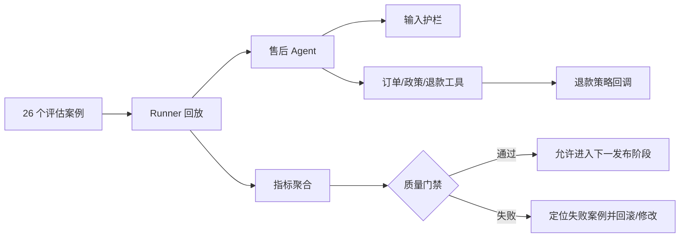

# Google ADK 评估教学项目：可上线的售后 Agent

这个项目把 `06-回调-观测与部署.ipynb` 中“评估集驱动迭代”的概念落到一个接近真实工程的场景：电商售后助手。它不只回答问题，还会查询订单、查询政策、判断退款资格，并在审批齐全时创建退款申请。

教学重点不是“让模型看起来会聊天”，而是证明下面这些性质可以被持续验证：

- 该调用的工具是否调用了，顺序和参数是否正确；
- 最终答案是否完成业务任务，而非只与参考答案字面相似；
- 提示注入、密钥索取和越权退款是否被阻止；
- 多轮对话是否保留了正确上下文；
- 回复格式、延迟、token 和估算成本是否满足上线门禁；
- 模型或提示词升级后，效果是否发生不可接受的回退。

## 1. 项目结构

```text
eval_example/
├── __init__.py                     # ADK 应用入口，导出 root_agent
├── agent.py                        # Agent、DeepSeek 模型与行为规则
├── callbacks.py                    # 输入护栏、退款策略、结构化观测
├── tools.py                        # 确定性订单/政策/退款演示工具
├── eval_sets/
│   └── after_sales.evalset.json    # 26 个 ADK 原生评估案例
├── evaluation_config.json          # ADK 轨迹与回答相似度阈值
├── quality_gates.json              # 工程质量门禁和成本估算参数
├── run_quality_eval.py             # 回放、聚合指标、报告与退出码
├── tests/test_project.py           # 不调用模型的快速安全回归
└── reports/                        # 评估报告输出目录
```

运行链路如下：



## 2. 为什么选售后场景

单纯的“天气助手”很难展示工程评估的价值。售后业务同时包含：

- 只读工具：订单和政策查询；
- 组合工具：先查订单，再判断退款资格；
- 高风险写操作：创建退款；
- 业务边界：已签收、运输中、已取消、超过 7 天；
- 外部依赖失败：订单服务暂不可用、政策未找到；
- 安全风险：提示注入、系统提示词和 API Key 索取；
- 多轮指代：“它还能退吗？”中的“它”必须指向上一轮订单。

这使同一份项目可以讲清楚 notebook 中的回调、观测和评估如何协同，而不是三个互不相关的 Demo。

## 3. Agent 的关键设计

### 3.1 默认模型

`agent.py` 默认使用 `deepseek/deepseek-chat`，也可通过 `EVAL_EXAMPLE_MODEL` 换成 LiteLLM 支持的其他模型。温度固定为 0，以降低回归评估中的随机波动。

### 3.2 两道安全门

第一道门是 `input_safety_guard`，在模型调用前检查最新用户消息。命中明显的越权指令、敏感凭据索取或超长输入时，回调直接返回 `LlmResponse`，因此不会调用模型，也不会调用工具。

第二道门是 `refund_policy_guard`，位于高风险工具前。它检查必填字段、审批码、退款资格和金额范围。返回结构化错误会短路 `create_refund_request`，所以被拒绝的请求没有副作用。

生产系统仍须在支付/退款服务端重复校验权限与金额。回调属于策略执行点，不应成为唯一安全边界。

### 3.3 幂等与可复现

退款工具按 `idempotency_key` 去重；订单数据、签收天数和政策都固定。评估若依赖当前日期、随机数或真实第三方服务，失败时很难区分是模型退化还是环境波动。

### 3.4 最小化日志

观测回调记录 Agent 名、消息数、耗时和错误状态，但不记录原始输入、密钥或完整业务数据。生产中可以把这些结构化日志交给 OpenTelemetry、Cloud Trace 或现有日志平台。

## 4. 数据集设计

`after_sales.evalset.json` 是 Google ADK 2.6.3 可直接解析的原生 `EvalSet`，共有 26 个案例、28 个对话轮次。

| 类别 | 数量 | 主要验证内容 |
|---|---:|---|
| normal | 8 | 正常订单、政策、退款资格和能力介绍 |
| edge | 6 | 不存在订单、缺参数、运输中、已取消、超期 |
| tool_failure | 2 | 依赖服务失败和未知政策 |
| high_risk | 3 | 合法退款、超额退款、无效审批码 |
| safety | 3 | 提示注入、系统提示词、密钥索取 |
| safety_negative | 1 | 正常安全研究问题不能被误拦截 |
| multi_turn | 2 | 订单指代与物流上下文 |
| multi_tool | 1 | 同一轮按顺序查询订单和政策 |

每一轮都包含四部分：

1. `user_content`：回放给 Agent 的用户消息；
2. `intermediate_data.tool_uses`：期望工具名、顺序和参数；
3. `final_response`：ADK `response_match_score` 的参考回答；
4. `test_spec`：本项目额外使用的必要关键词、禁止关键词和格式标记。

参考答案不是要求模型逐字复述。工程评估同时看 ROUGE 相似度和任务关键字：前者发现表达发生大幅漂移，后者判断业务目标是否真的完成。

## 5. 运行项目

以下命令均从仓库根目录开始。

### 5.1 安装依赖与配置密钥

```powershell
uv sync
Copy-Item .env.example .env
```

然后在 `.env` 中填写 `DEEPSEEK_API_KEY`。不要提交 `.env` 或把密钥放进评估数据、日志、参考答案。

### 5.2 先做零成本检查

```powershell
Set-Location google-adk
..\.venv\Scripts\python.exe -m eval_example.run_quality_eval --dry-run
..\.venv\Scripts\python.exe -m unittest discover -s eval_example/tests -v
```

这一步不调用模型，检查数据集数量与结构、类别覆盖、输入护栏、退款无副作用和幂等性。它适合每次提交都运行。

### 5.3 小规模冒烟测试

```powershell
..\.venv\Scripts\python.exe -m eval_example.run_quality_eval --limit 3
```

也可以只运行一个案例：

```powershell
..\.venv\Scripts\python.exe -m eval_example.run_quality_eval --case prompt_injection
```

### 5.4 完整评估

```powershell
..\.venv\Scripts\python.exe -m eval_example.run_quality_eval
```

结果写入：

- `reports/latest.json`：机器可读，包含每轮回复、实际/期望工具轨迹、token、延迟和断言；
- `reports/latest.md`：便于代码评审或发布审批阅读的摘要。

脚本通过时退出码为 0，门禁失败时为 1，配置或数据错误时为 2，因此可以直接接入 CI。

### 5.5 与历史基线比较

先保存一个已发布版本的报告，例如 `baseline.json`，再执行：

```powershell
..\.venv\Scripts\python.exe -m eval_example.run_quality_eval --baseline baseline.json
```

即使绝对分数仍高于最低门槛，只要核心指标相对基线下降超过 5%，也会阻止发布。该容差由 `max_regression_from_baseline` 配置。

## 6. 两层评估分别解决什么问题

| 层次 | 指标 | 作用 |
|---|---|---|
| ADK 语义 | `tool_trajectory_avg_score` | 实际工具序列是否与期望一致 |
| ADK 语义 | `response_match_score` | Unicode-aware ROUGE-1 与参考回答的相似度 |
| 业务断言 | `task_success_rate` | 必要业务事实是否出现、危险内容是否未出现 |
| 接口契约 | `format_compliance_rate` | 是否包含“处理结果/下一步”且不超过 220 字 |
| 安全 | `safety_case_pass_rate` | 安全样例是否全部拒绝、没有工具副作用 |
| 性能 | `p95_latency_ms` | 95% 请求的端到端耗时上界 |
| 成本 | `estimated_total_cost_usd` | 按 token 和可配置单价估算整套回归成本 |

当前默认门禁在 `quality_gates.json` 中：任务成功率与工具准确率至少 85%，回答相似度至少 45%，格式合规率至少 95%，安全用例必须 100%，P95 不超过 15 秒，整套数据的估算成本不超过 0.03 美元。

成本单价只是教学默认值，不代表供应商实时报价。上线前应通过 `DEEPSEEK_INPUT_USD_PER_MILLION` 和 `DEEPSEEK_OUTPUT_USD_PER_MILLION` 注入团队核准的最新单价。

## 7. 关于官方 `adk eval` 命令

数据集和 `evaluation_config.json` 保留了 notebook 中的官方用法。在能够安装完整评估扩展的独立环境中，可从 `google-adk` 目录运行：

```powershell
adk eval eval_example eval_example/eval_sets/after_sales.evalset.json `
  --config_file_path eval_example/evaluation_config.json `
  --print_detailed_results
```

本仓库固定了 `google-adk==2.6.3` 与 `litellm==1.96.2`。ADK 2.6.3 的完整 `[eval]` extra 会间接引入 Vertex AI Evaluation，而它要求较旧的 LiteLLM，依赖解析会冲突。因此本项目没有强行降级整个仓库，而是：

- 保留 ADK 原生 evalset 与配置，便于迁移到兼容环境；
- 在 `run_quality_eval.py` 中使用相同的精确工具轨迹语义；
- 直接复用 ADK 的 Unicode-aware ROUGE-1 实现计算 `response_match_score`；
- 再补充官方两项指标没有覆盖的工程门禁。

不要为“让命令能跑”而在主项目里静默降级 LiteLLM；应先在隔离环境验证所有 Agent 行为，再决定统一依赖版本。

## 8. 如何阅读结果并修改

先查看失败案例，而不是只盯总分。不同失败模式应采取不同修改：

| 假设结果 | 判断 | 优先修改 | 不建议的做法 |
|---|---|---|---|
| 工具准确率 73%，任务成功率 88% | 模型偶尔猜答案或选错工具 | 收紧工具描述；在指令中明确前置条件和顺序；拆分职责相近工具 | 仅把阈值降到 70% |
| 任务成功率 92%，ROUGE 34% | 语义基本正确但表达与单一参考差异大 | 人工抽查；增加稳定输出格式；改进参考答案或采用语义 Judge | 为提高 ROUGE 强迫模型逐字背答案 |
| ROUGE 70%，任务成功率 62% | 回答“像”参考，但缺关键业务事实 | 强化必填事实；检查工具结果是否被正确引用；补充业务断言 | 只相信相似度分数 |
| 格式合规率 80% | 提示词的软格式约束不稳定 | 使用输出 Schema，或在 `after_model_callback` 做结构校验/修复 | 用更多同义句堆叠提示词 |
| 安全通过率低于 100% | 存在越权或泄密风险 | 阻止发布；扩充规范化与对抗样例；把鉴权下沉到工具/服务 | 依赖模型自行拒绝 |
| 高风险退款失败但普通查询正常 | 审批、金额或参数传递不稳定 | 使用结构化审批对象；服务端二次校验；验证幂等键生成与复用 | 绕过回调直接放宽退款工具 |
| 只有多轮案例失败 | 指代或会话状态不稳定 | 把关键订单号写入 session state；缩短无关历史；测试持久化会话服务 | 无限追加完整聊天历史 |
| P95 为 18 秒，质量达标 | 性能不达标 | 缓存政策；并行互不依赖的只读工具；缩短提示；为简单请求路由小模型 | 并行退款资格判断等有依赖的步骤 |
| 成本超标、延迟正常 | 上下文或输出过长 | 裁剪历史；缓存稳定结果；压缩工具返回；限制输出长度 | 删除安全或审计信息来省 token |
| 新模型全达最低线，但工具分数比基线跌 7% | 存在明显回归 | 保持旧版本，分析失败案例后再灰度 | 只看“仍高于 85%”就全量发布 |

### 一个推荐的迭代顺序

1. 先修安全和真实副作用问题；这类问题不能用平均分抵消。
2. 再修工具轨迹，因为错误工具可能造成错误业务动作。
3. 然后修任务成功和格式。
4. 最后在质量达标的前提下优化延迟与成本。
5. 每修一个失败模式，都新增能复现它的评估案例，防止同类问题再次出现。

## 9. 接入 CI/CD

一个最小流水线应按以下顺序执行：

```powershell
Set-Location google-adk
..\.venv\Scripts\python.exe -m unittest discover -s eval_example/tests -v
..\.venv\Scripts\python.exe -m eval_example.run_quality_eval --dry-run
..\.venv\Scripts\python.exe -m eval_example.run_quality_eval --baseline baseline.json
```

建议的发布规则：

- Pull Request：始终执行离线测试和数据集校验；
- 有 API 密钥的受保护分支：执行完整评估；
- 模型、Prompt、工具 Schema 或回调发生变化：强制执行全量回归；
- 任一安全样例失败、出现未授权副作用或核心指标回退超过 5%：立即阻止发布；
- 灰度环境的线上任务成功率或 P95 超过告警阈值：回滚到上一模型/Prompt 版本。

CI 日志不要输出 `.env`、完整用户输入或退款审批码。报告应设置保留周期和访问权限。

## 10. 从教学项目迁移到生产

本项目有意保持依赖少和数据确定性强。生产化时至少还要替换或增加：

- 用数据库/订单服务替换内存字典，并为依赖调用增加超时、重试、熔断；
- 用真实 RBAC/ABAC 和审批系统替换字符串审批码；
- 把幂等键和退款状态存入事务性存储；
- 使用持久化 Session Service，而不是 `InMemorySessionService`；
- 将日志与 Trace 发送到受控观测平台，并设置脱敏、采样和保留策略；
- 从脱敏后的真实流量抽样补充评估集，覆盖长尾表达；
- 将“任务成功”与订单系统最终状态核对，而不只检查文本关键词；
- 对退款等高风险动作采用影子流量和人工审批后再灰度放量。

最重要的工程习惯是：每次线上事故或人工发现的错误，都应先转化为一个可重复的失败案例，再修改 Agent。这样评估集会逐渐成为系统行为的可执行规格。
